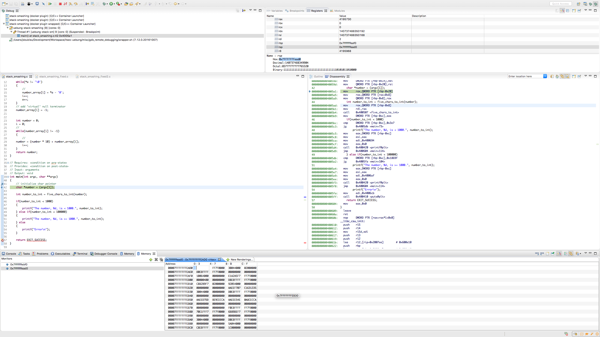

# Docker GDB Container for Eclipse
Debug C applications with gdb on MacOS and Windows using Eclipse and Docker.



## Motivation
gdb is not supported on MacOS X since Leopard. The only debugger that works is lldb. However Eclipse does not support the llvm stack.
One solution is to use a MI bridge which is compatible with lldb (e.g. lldb-mi).

Using docker you already have linux installed on your computer.

## Requirements
* Docker 12+
* Eclipse (CDT)
    * C/C++ Docker Container Launch Support Plugin

## Installation
Clone this repository:
```
git clone https://github.com/jdoubleu/docker-gdb-eclipse.git
```
and change into the directory.

### Eclipse Docker Plugin
To install the C/C++ Docker Container Launch Support Plugin navigate to `Help > Install New Software`, then select your Eclipse' versions repository (e.g. `http://download.eclipse.org/releases/oxygen`).
Look for `Programming Languages > C/C++ Docker Container Launch Support`.

### Build the container
There's already a build script included. Simply run:
```
./build.sh
```

## Configuration
Now open your C project and edit the build configuration.
Open a file in your project and navigate to `Project > Properties`. Open the `C/C++ Build` tree.
It is recommended to create a new build configuration under `Manage configurations`.

After creating and selecting the new build configuration open the `Tool Chain Editor` page and make sure the current toolchain is set to `Linux GCC`.
Go to page `Settings` and open `Container settings`. Enable docker, select your connection and enter `jdoubleu/gdb` as docker image.
Save your build configuration.

Now let's build your project using the new configuration: Click the arrow next to the hammer icon and select the name of your newly created build configuration.

Next create a new debug/run configuration.
Add a new configuration of type `C/C++ Container Launcher`.
The `C/C++ Application` should be the compiled version of your new build configuration. You may want to automatically build the project using the previous build configuration automatically when needed.
Now open the tab `Container` and again enter `jdoubleu/gdb`.
Under `Debugger` tab you nee to change the gdb binary (`GDB debugger`) to the `wrapper.sh` script included in this repository. Set `GDB command file` to `/root/.gdbinit`.

## Run
Now you are able to start debugging the code from inside a docker container. Eclipse will automatically start the required container and your programm. Just run the debug configuration.